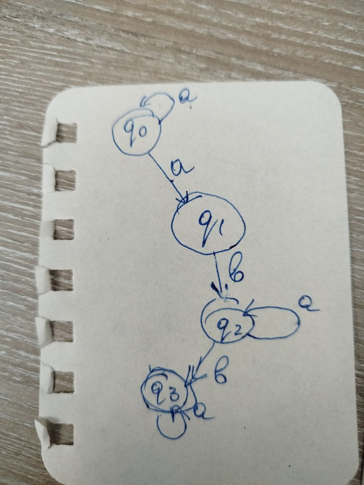
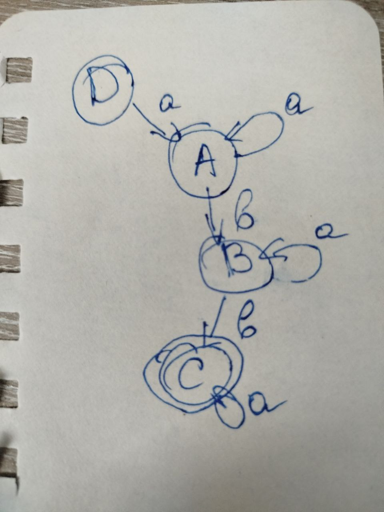

# Laboratory Work 2: Determinism in Finite Automata. Conversion from NDFA to DFA. Chomsky Hierarchy

### Course: Formal Languages & Finite Automata
### Author: Pancenco Ina, FAF-242

----

## Overview

In formal language theory, every regular language can be described equivalently by a regular grammar or by a finite automaton. While the first laboratory established this connection from the grammar side, this work approaches it from the automaton side, starting with a nondeterministic finite automaton (NFA), converting it to a deterministic finite automaton (DFA), extracting a regular grammar, and classifying that grammar according to the Chomsky hierarchy. These operations are not merely algorithmic exercises; they reveal the deep structural relationships between different models of computation and the languages they define.

## Objectives

1. Implement a function in the Grammar class that classifies a grammar according to the Chomsky hierarchy.

2. Extend the existing project to support conversions between finite automata and regular grammars, determinism checking, and NFA-to-DFA transformation.

3. Test and verify that the NFA and the resulting DFA recognize exactly the same language.

## Theory

### Finite Automata and Determinism

A finite automaton is a mathematical model of computation defined by the 5-tuple (Q, Σ, δ, q₀, F), where Q is a finite set of states, Σ is the input alphabet, δ is the transition function, q₀ is the initial state, and F is the set of accepting (final) states. The key distinction between deterministic and nondeterministic automata lies in the transition function. In a deterministic finite automaton (DFA), δ maps each (state, symbol) pair to exactly one next state, meaning the machine's behavior is completely predictable at every step. In a nondeterministic finite automaton (NFA), δ maps each (state, symbol) pair to a *set* of possible next states, allowing the machine to "branch" into multiple computational paths simultaneously.

Despite the apparent increase in power, a foundational result in automata theory is that NFAs and DFAs are equivalent in expressiveness, they recognize precisely the same class of languages, namely the regular languages. The proof of this equivalence is constructive: for any NFA, there exists a DFA that accepts the same language, and it can be built systematically through the subset construction algorithm.

### Subset Construction (NFA to DFA)

The subset construction, also known as the powerset construction, transforms an NFA into an equivalent DFA by treating sets of NFA states as individual DFA states. The algorithm begins with the DFA start state defined as the singleton set containing the NFA's start state, {q₀}. For each DFA state (which is a set of NFA states) and each input symbol, the algorithm computes the union of all NFA transitions from every state in that set. This union becomes the next DFA state. The process continues until no new DFA states are discovered. A DFA state is marked as accepting if it contains at least one NFA accepting state.

In the worst case, the resulting DFA can have up to 2ⁿ states for an NFA with n states, since every subset of NFA states is a potential DFA state. In practice, however, many of these subsets are unreachable, and the algorithm only constructs the reachable portion of the powerset.

### Conversion from Finite Automaton to Regular Grammar

The conversion from a finite automaton to a right-linear regular grammar follows directly from the structural correspondence between the two formalisms. Each state in the automaton becomes a non-terminal symbol in the grammar, each alphabet symbol becomes a terminal, and each transition δ(q, a) = r produces a production rule q → ar. Final states receive an additional epsilon production (q → ε) to indicate that derivation can terminate there. The start symbol of the grammar corresponds to the start state of the automaton. This construction guarantees that the grammar generates exactly the language recognized by the automaton.

### The Chomsky Hierarchy

The Chomsky hierarchy, introduced by Noam Chomsky in 1956, classifies formal grammars into four types based on the form of their production rules, each corresponding to a class of languages and a class of automata:

**Type 0 — Unrestricted grammars** place no restrictions on production rules. The left-hand side can be any string containing at least one non-terminal, and the right-hand side can be any string of terminals and non-terminals. These grammars generate the recursively enumerable languages, which are recognized by Turing machines.

**Type 1 — Context-sensitive grammars** require that every production αAβ → αγβ satisfies |γ| ≥ 1, or equivalently that the right-hand side is at least as long as the left-hand side (with the possible exception of S → ε if S does not appear on the right side of any rule). These grammars generate context-sensitive languages, recognized by linear-bounded automata.

**Type 2 — Context-free grammars** restrict the left-hand side of every production to a single non-terminal symbol (A → γ, where A ∈ VN). The right-hand side can be any combination of terminals and non-terminals. Context-free grammars generate context-free languages, recognized by pushdown automata. Most programming language syntaxes are described by context-free grammars.

**Type 3 — Regular grammars** are the most restrictive. In a right-linear regular grammar, every production takes one of the forms A → aB or A → a (where A, B are non-terminals and a is a terminal), or A → ε. Regular grammars generate regular languages, which are exactly the languages recognized by finite automata. This is the type most relevant to this laboratory.

Each type strictly includes the one below it: every regular language is context-free, every context-free language is context-sensitive, and every context-sensitive language is recursively enumerable.

## Variant Definition

The finite automaton for this implementation follows the assigned variant:

**States:** Q = {q0, q1, q2, q3}
**Alphabet:** Σ = {a, b, c}
**Start state:** q0
**Final states:** F = {q3}
**Transition function δ:**

| Current State | Input | Next States |
|:---:|:---:|:---:|
| q0 | a | {q0, q1} |
| q1 | b | {q2} |
| q2 | a | {q2} |
| q2 | b | {q3} |
| q3 | a | {q3} |

This automaton is nondeterministic because the transition δ(q0, a) leads to two states simultaneously. The language it recognizes consists of strings that follow a path from q0 to the accepting state q3, specifically strings matching the pattern a⁺ b a* b a* — one or more a's, followed by b, optionally more a's, then b, and optionally more a's.


*Figure 1: The initial nondeterministic finite automaton (NFA) for the given variant.*

## Implementation Description

### Determinism Check

The automaton is deterministic if and only if every transition maps to exactly one next state. The `is_deterministic()` method iterates over all entries in the transition map and returns False as soon as it finds a transition with more than one destination. This is a straightforward linear scan that directly encodes the formal definition.

```python
def is_deterministic(self):
    for key in self.delta:
        if len(self.delta[key]) > 1:
            return False
    return True
```

### FA to Regular Grammar

The conversion from finite automaton to regular grammar follows the theoretical construction described above. Each transition δ(q, a) → r produces a production q → ar, and each final state receives an epsilon production. The resulting grammar is guaranteed to be right-linear regular.

```python
def to_regular_grammar(self):
    from grammar import Grammar
    VN = set(self.Q)
    VT = set(self.Sigma)
    S = self.q0
    P = {}

    for (state, symbol), next_states in self.delta.items():
        for next_state in next_states:
            right = symbol + next_state
            P.setdefault(state, []).append(right)

    for f in self.F:
        P.setdefault(f, []).append("")

    return Grammar(VN, VT, P, S)
```

### Grammar Classification

The `classify_grammar()` method determines where a grammar falls in the Chomsky hierarchy by checking productions against increasingly relaxed constraints. It first tests for Type 3 (regular) by verifying that every left-hand side is a single non-terminal and every right-hand side consists of a terminal optionally followed by a non-terminal. If that fails, it checks for Type 2 (context-free) by requiring only single non-terminals on the left. Then it checks for Type 1 (context-sensitive) through the length non-decreasing condition. If none of these hold, it defaults to Type 0.

```python
def classify_grammar(self):
    is_regular = True
    for left, rights in self.P.items():
        if left not in self.VN:
            is_regular = False
            break
        for right in rights:
            if right == "":
                continue
            terminal = None
            for t in sorted(self.VT, key=len, reverse=True):
                if right.startswith(t):
                    terminal = t
                    break
            if terminal is None:
                is_regular = False
                break
            rest = right[len(terminal):]
            if rest != "" and rest not in self.VN:
                is_regular = False
                break

    if is_regular:
        return "Type 3 - Regular grammar"

    is_cfl = all(left in self.VN for left in self.P.keys())
    if is_cfl:
        return "Type 2 - Context-Free grammar"

    is_csl = True
    for left, rights in self.P.items():
        for right in rights:
            if len(right) < len(left):
                is_csl = False
                break
        if not is_csl:
            break

    if is_csl:
        return "Type 1 - Context-Sensitive grammar"

    return "Type 0 - Unrestricted grammar"
```

### NDFA to DFA (Subset Construction)

The `to_dfa()` method implements the subset construction algorithm. It maintains a worklist of unprocessed DFA states (each represented as a frozenset of NFA states). For each unprocessed state and each alphabet symbol, it computes the set of reachable NFA states and records the transition. New DFA states are added to the worklist as they are discovered. The algorithm terminates when no new states remain to be processed.

```python
def to_dfa(self):
    start = frozenset({self.q0})
    dfa_states = {start}
    unprocessed = [start]
    dfa_delta = {}

    while unprocessed:
        current = unprocessed.pop(0)
        for symbol in self.Sigma:
            next_set = set()
            for state in current:
                key = (state, symbol)
                if key in self.delta:
                    next_set |= self.delta[key]

            next_frozen = frozenset(next_set)
            dfa_delta[(current, symbol)] = next_frozen
            if next_frozen not in dfa_states:
                dfa_states.add(next_frozen)
                unprocessed.append(next_frozen)

    dfa_final_states = set()
    for state_set in dfa_states:
        if any(s in self.F for s in state_set):
            dfa_final_states.add(state_set)

    return FiniteAutomaton(
        states=dfa_states,
        alphabet=self.Sigma,
        transitions=dfa_delta,
        start_state=start,
        final_states=dfa_final_states
    )
```

After applying the subset construction, the resulting DFA is shown below:


*Figure 2: The deterministic finite automaton (DFA) obtained after NFA-to-DFA conversion via subset construction.*

## Testing and Verification

The `main.py` client exercises the full pipeline. It builds the NFA from the variant definition, classifies the resulting grammar, checks determinism, displays the step-by-step grammar conversion, performs the subset construction, and finally runs an equivalence check on a suite of test strings. The test suite includes both accepted strings (such as "abb", "abba", "aabb", "abab") and rejected strings (such as "a", "ab", "aba", "aaab"), verifying that the NFA and DFA produce identical accept/reject decisions for every input.

Example output:

```
========================================
 CHOMSKY HIERARCHY CLASSIFICATION
========================================
Variant grammar is: Type 3 – Regular grammar

========================================
 3a. NDFA -> REGULAR GRAMMAR
========================================
Conversion steps:
  δ(q0,a) -> q0   =>   q0 -> aq0
  δ(q0,a) -> q1   =>   q0 -> aq1
  δ(q1,b) -> q2   =>   q1 -> bq2
  δ(q2,a) -> q2   =>   q2 -> aq2
  δ(q2,b) -> q3   =>   q2 -> bq3
  δ(q3,a) -> q3   =>   q3 -> aq3
  q3 ∈ F           =>   q3 -> ε

========================================
 EQUIVALENCE CHECK (NDFA vs DFA)
========================================
String     NDFA       DFA
abb        True       True       OK
abba       True       True       OK
aabb       True       True       OK
abab       True       True       OK
a          False      False      OK
ab         False      False      OK
aba        False      False      OK
aaab       False      False      OK
```

All test cases produce matching results between the NFA and the DFA, confirming that the subset construction preserves the recognized language. The grammar is correctly classified as Type 3 (Regular), which is consistent with the fact that it was derived from a finite automaton.

## Conclusions

This laboratory work demonstrates the deep connections between the core concepts of formal language theory. Starting from a nondeterministic finite automaton, the implementation successfully performs three fundamental operations: determinism verification, NFA-to-DFA conversion via subset construction, and extraction of a regular grammar with Chomsky hierarchy classification. The equivalence check confirms that the DFA accepts exactly the same language as the original NFA, validating the correctness of the subset construction. The grammar classifier correctly identifies the resulting grammar as Type 3 (Regular), which aligns with the theoretical expectation that any grammar derived from a finite automaton must be regular. Together, these results illustrate the practical applicability of the Chomsky hierarchy and the algorithmic equivalence between nondeterministic and deterministic models of finite-state computation.
